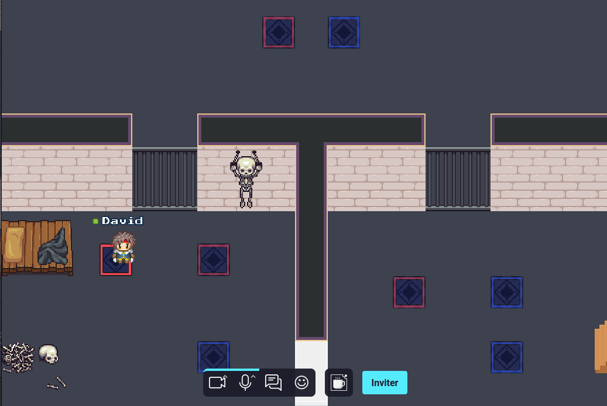

# Programmez votre escape game!



Ce repository contient le code associé à l'article "Programmez votre escape game!" publié dans le magazine Programmez!

## Installation

Pour installer le projet, vous devez avoir Node.js version >=16 installé sur votre machine.

```shell
npm install
npm run dev
```

## Tester la map en production

Pour déployer la carte, forkez ce repository et activez "Github Pages".

Rendez-vous ensuite sur le site Github Pages de votre repository.

Plus de détails ici: https://workadventu.re/map-building/

## Structure

* *public*: Fichiers statics (PDFs, fichiers audio...)
* *src*: Scripts
* *tilesets*: Les tilesets utilisés pour la carte
* *map.tmj*: La carte elle-même, au fomat "Tiled Map JSON"
* *map.png*: Une preview de la carte

## Licenses

Ce projet contient plusieurs licenses:

* [Code license](./LICENSE.code) *(tous les fichiers à l'exception des fichiers couverts par d'autres licences)*
* [Map license](./LICENSE.map) *(`map.tmj` et `map.png`)*
* [Assets license](./LICENSE.assets) *(les fichiers dans le répertoire `tilesets/`)*

